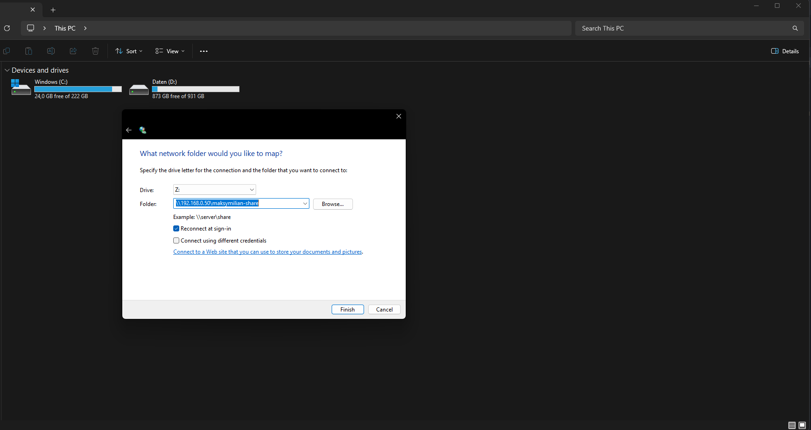
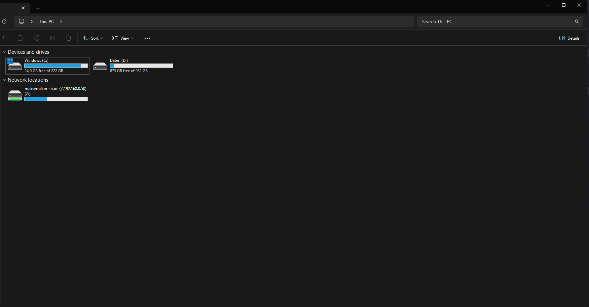
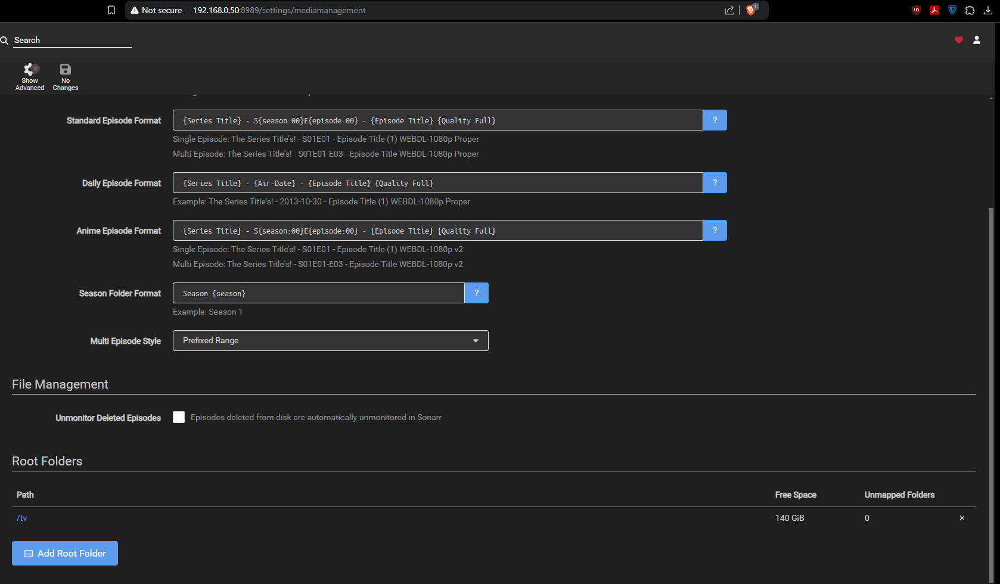
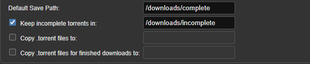
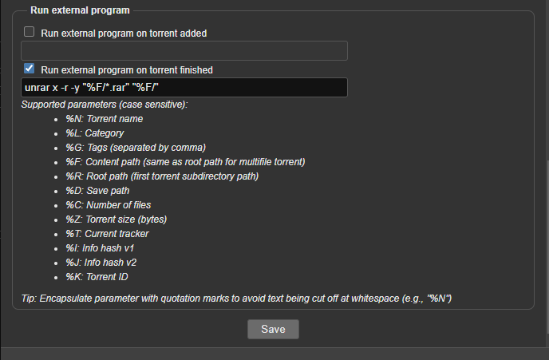
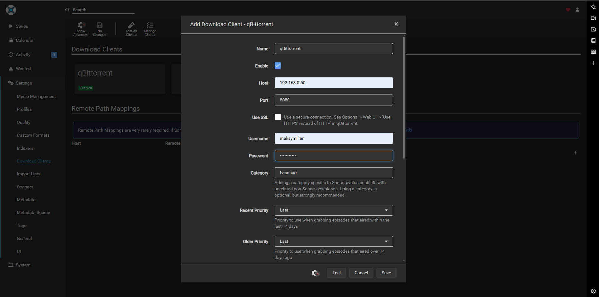
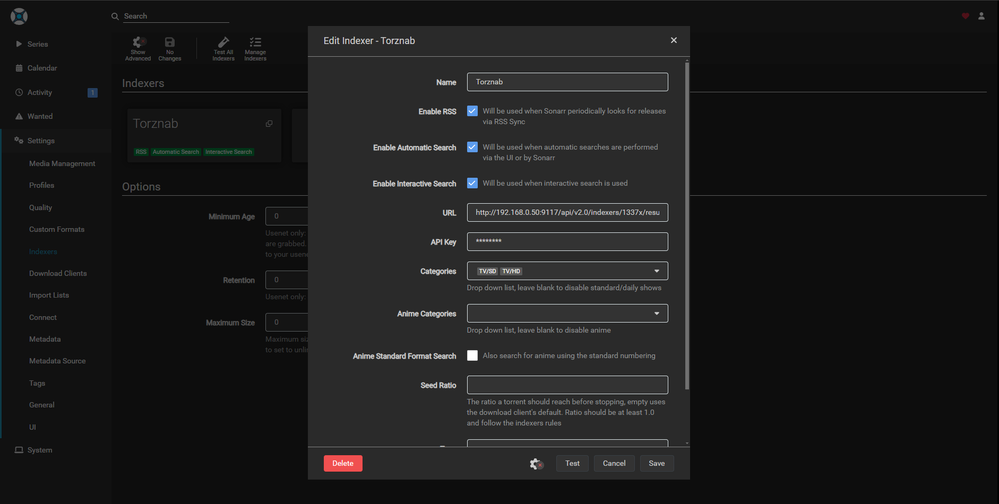
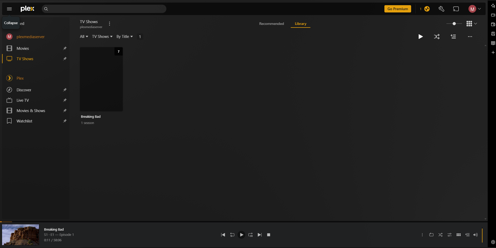
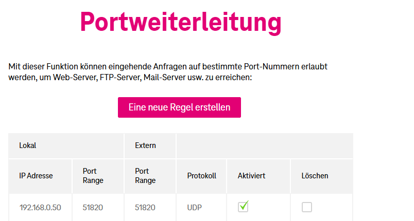

## Linux Home Server

Verfasser: **Maksymilian Saferyjski 2CHIT**

Datum: **13.01.2025**

## 1. Einführung
Ich bin mir sicher, dass wir alle mit Windows oder Mac schon bekannt sind. Jedes Betriebssystem hat seine Vor- und Nachteile, aber das heutzutage am meistgenutzte Betriebssystem für Computer, die als Server fungieren, ist Linux. Linux ist open source, kostenlos und hat keine strengen Voraussetzungen, was Hardware betrifft. Nachteil jedoch ist, dass Programme die, in Windows oder Mac funktionieren, werden höchstwahrscheinlich nicht auf Linux funktionieren. Aufgrund dass Linux open source ist, gibt es verschiedene Distributions, die man nutzen kann. In dieser EK werden ich mich mit Ubuntu auseinandersetzen und ein nützlichen Home Server zusammenbastelln.
## 2. Projektbeschreibung
Es wurde ein Ubuntu Home Server realisiert, mit dem Samba, Home Assistant, Sonarr, PiVPN und Plex eingerichtet wurde. Dies wurde mit verschiedenen Mitteln erreicht, wie z.B. Docker oder dem APT Manager.
## 3. Theorie

Linux Terminal 

Docker 

Netzwerktechnik

## 4. Arbeitsschritte
**Ubuntu installieren**

Ubuntu ISO-Datei aus dem Internet herunterladen und auf einen USB-Stick mit balenaEtcher flashen

In den USB-Stick reinbooten bzw VM starten

Ubuntu vollständig installieren

**OpenSSH**

Weil Server meistens keine grafische Oberfläche haben, werden sie mit OpenSSH ferngesteuert
Als Voraussetzung braucht unser Server eine statische IP-Adresse, dies kann ganz einfach gemacht werden indem man auf die Netzwerkeinstellungen geht

```Einstellungen -> Netzwerk -> auf das kleine Zahnrad -> IPv4```

Statische IPv4 einstellen z.B.

 ```Adresse: 192.168.0.50 Subnetzmaske: 255.255.255.0 Gateway: 192.168.0.1 DNS: 1.1.1.1 ```

Netzwerk neustarten und nun haben wir eine statische IP-Adresse

Um OpenSSH zu installieren, muss man in das Terminal eintauchen

Package Manager auf den neusten Stand bringen

```sudo apt update```

OpenSSH installieren

```sudo apt install openssh-server```

Prüfen ob OpenSSH läuft

```sudo systemctl status ssh```

Umsteigen aufs externe Gerät und Powershell öffnen

In Powershell eingeben:

```ssh benutzername@IP-Adresse des Servers z.B. 192.168.0.50```

Passwort eingeben

Nun können wir unseren Server fernsteuern, aber nur wenn wir uns in dem selben LAN befinden wie der Server

**Samba Fileshare**

Prüfen ob wir auf dem neusten Stand sind

```sudo apt update```

Samba installieren

```sudo apt install samba```

Prüfen ob Samba auch wirklich installiert ist

```samba --version```

Ein Ordner für Samba erstellen

z.B. ```mkdir maksymilian-share```

Nun müssen wir noch Samba konfigurieren, damit er diesen Ordner auch wirklich nutzt

```sudo nano /etc/samba/smb.conf```

Nach ganz unten scrollen und folgende Zeilen hinzufügen

```
[maksymilian-share]
    comment = Maksymilian Samba Share
    path = \home\maksymilian\maksymilian-share
    read only = no
    browsable = yes
```

```strg-x + y + enter``` um zu speichern und schließen

Samba neustarten

```sudo service smbd restart```

Firewall konfigurieren, damit Samba das Netzwerk ohne Probleme navigieren kann

```sudo ufw allow samba```

Benutzername und Passwort für Samba festlegen

```sudo smbpasswd -a maksymilian```

Passwort festlegen

Nun sollten wir in der Lage sein, mit unserem Server, Dateien auszutauschen

Um dies zu überprüfen, geht man in den File Explorer -> diesen PC -> Netzlaufwerk verbinden



Nach Eingabe unserer Logindaten sollten wir nun in der Lage sein, auf unseren Samba Share zuzugreifen



Nun können wir mit unserem Server Dateien austauschen

**Plex**

Für diesen Teil benötigen wir Docker Compose

Docker installieren

```
# Fügen Sie den offiziellen GPG-Schlüssel von Docker hinzu:
sudo apt-get update
sudo apt-get install ca-certificates curl
sudo install -m 0755 -d /etc/apt/keyrings
sudo curl -fsSL https://download.docker.com/linux/ubuntu/gpg -o /etc/apt/keyrings/docker.asc
sudo chmod a+r /etc/apt/keyrings/docker.asc

# Fügen Sie das Repository zu den Apt-Quellen hinzu:
echo \
  "deb [arch=$(dpkg --print-architecture) signed-by=/etc/apt/keyrings/docker.asc] https://download.docker.com/linux/ubuntu \
  $(. /etc/os-release && echo "$VERSION_CODENAME") stable" | \
  sudo tee /etc/apt/sources.list.d/docker.list > /dev/null
sudo apt-get update
```

```sudo apt-get install docker-ce docker-ce-cli containerd.io docker-buildx-plugin docker-compose-plugin```

Einen Ordner für die Speicherung unserer yaml Dateien

```cd ~```

```mkdir docker-composes```

```cd docker-composes```

```mkdir plex```

```mkdir qbittorrent```

```mkdir sonarr```

```mkdir radarr```

```mkdir jacketts```

```mkdir homeassistant```

```cd plex```

```touch docker-compose.yml```

```sudo nano docker-compose.yml```

Folgende Zeilen zur Datei hinzufügen

```
services:
  plex:
    image: lscr.io/linuxserver/plex:latest
    container_name: plex
    network_mode: host
    environment:
      - PUID=1000
      - PGID=1000
      - TZ=Europe/Vienna
      - VERSION=docker
      - PLEX_CLAIM= #optional
    volumes:
      - /home/maksymilian/plex/data:/config
      - /home/maksymilian/maksymilian-share/tv:/tv
      - /home/maksymilian/maksymilian-share/movies:/movies
    restart: unless-stopped
```

Aber bevor wir die yaml-Datei starten, müssen wir noch unsere Ordner erstellen

```cd ~/maksymilian-share```

```mkdir plex```

```cd plex```

```mkdir tv```

```mkdir movies```

```cd ~```

```mkdir data```

```mkdir HASS```

```mkdir plex```

```mkdir sonarr```

```mkdir radarr```

```mkdir jacketts```

```mkdir blackhole```

```mkdir qbittorrent```


```cd plex```

```mkdir data```

```cd sonarr```

```mkdir data```

```cd radarr```

```mkdir data```

```cd jacketts```

```mkdir data```

```cd qbittorrent```

```mkdir data```

```cd data```

```mkdir complete```

```mkdir incomplete```

Nun kehren wir zur unserer yaml-Datei zurück und starten diese

```docker compose up -d```

Falls alles funktioniert hat, sollten wir jetzt in der Lage sein, auf das Plex Webinterface zuzugreifen

In den Webbrowser eingeben

```http://192.168.0.50:32400/```

Plex und unseren Pfad für TV und Filme einrichten

**Home Assistant**

Home Assistant ist ein nützlicher Dienst, der uns ermöglicht, diverse Automationen durchzuführen.

```cd ~/docker-composes/homeassistant```

```touch docker-compose.yml```

```sudo nano docker-compose.yml```

```
services:
  homeassistant:
    image: lscr.io/linuxserver/homeassistant:latest
    container_name: homeassistant
    network_mode: host
    environment:
      - PUID=1000
      - PGID=1000
      - TZ=Europe/Vienna
    volumes:
      - /home/maksymilian/HASS:/config
    ports:
      - 8123:8123 
    restart: unless-stopped
```

```docker compose up -d```

Auf das Webinterface zugreifen

```http://192.168.0.50:8123```

Einloggen und Home Assistant entdecken

**Sonarr**

Sonarr wird uns Serien aus dem Internet herunterladen

Um Sonarr herunterzuladen, brauchen wir auch ein Docker Compose

```cd ..```

```cd sonarr```

```touch docker-compose.yml```

```sudo nano docker-compose.yml```

Folgenden Inhalt hinzufügen

```
services:
  sonarr:
    image: lscr.io/linuxserver/sonarr:latest
    container_name: sonarr
    environment:
      - PUID=1000
      - PGID=1000
      - TZ=Europe/Vienna
    volumes:
      - /home/maksymilian/sonarr/data:/config
      - /home/maksymilian/maksymilian-share/plex/tv:/tv #optional
      - /home/maksymilian/data:/downloads #optional
    ports:
      - 8989:8989
    restart: unless-stopped
```

```docker compose up -d```

Nun sollten wir in der Lage sein, auf das Sonarr Webinterface zuzugreifen

```http://192.168.0.50:8989/```

Einloggen -> Settings -> Media Management

**Rename Episodes**

**Replace Illegal Character**

TV Ordner hinzufügen



**qbittorrent**

Um aus dem Internet etwas herunterzuladen, benötigen wir einen Download-Client

Zu unserem qbittorrent Ordner navigieren

```cd ~/docker-composes/qbittorrent```

```touch docker-compose.yml```

```sudo nano docker-compose.yml```

```
services:
  qbittorrent:
    image: lscr.io/linuxserver/qbittorrent:latest
    container_name: qbittorrent
    environment:
      - PUID=1000
      - PGID=1000
      - TZ=Etc/UTC
      - WEBUI_PORT=8080
      - TORRENTING_PORT=6881
    volumes:
      - /home/maksymilian/qbittorrent/data:/config
      - /home/makymilian/data:/downloads 
    ports:
      - 8080:8080
      - 6881:6881
      - 6881:6881/udp
    restart: unless-stopped
```

```docker compose up -d```

Auf das Webinterface zugreifen

```http://192.168.0.50:8080/```

Einloggen und auf die Einstellungen navigieren

Default Save Path und Keep incomplete Torrents in einstellen



Runterscrollen -> Run external program on torrent finished

```unrar x -r -y "%F/*.rar" "%F/"```



Speichern und auf Sonarr zurückkehren

Settings -> Download Clients -> große Plus -> qBittorrent -> folgende Daten angeben



Speichern und somit haben wir einen Download-Client

**Indexer**

Zuletzt benötigen wir noch ein Indexer, der die Seiten für uns durchsucht

```cd ~/docker-composes/jacketts```

```touch docker-compose.yml```

```sudo nano docker-compose.yml```

```
services:
  jackett:
    image: lscr.io/linuxserver/jackett:latest
    container_name: jackett
    environment:
      - PUID=1000
      - PGID=1000
      - TZ=Etc/UTC
      - AUTO_UPDATE=true #optional
      - RUN_OPTS= #optional
    volumes:
      - /home/maksymilian/jackett/data:/config
      - /home/maksymilian/blackhole:/downloads
    ports:
      - 9117:9117
    restart: unless-stopped
```

```docker compose up -d```

Auf das Webinterface zugreifen

```http://192.168.0.50:9117/UI/Dashboard```

Add Indexer -> eine Seite auswählen z.B. 1337 -> runterscrollen -> Add Selected

API Key kopieren

Zu Sonarr zurückkehren

Settings -> Indexers -> große Plus -> Torznab -> folgende Daten angeben



Jetzt können wir Serien endlich herunterladen

Dafür geht man auf Series -> Add New -> z.B. Breaking Bad -> Luppen Symbol auf einer Season

Nun sollte der Download-Prozess gestartet sein

Falls alles erfolgreich lief, sollte die Serie auch nun in Plex verfügbar sein



**Radarr**

Die gleiche Anwendung wie Sonarr, nur für Filme gedacht

Selber Prozess, nur andere yaml-Datei

```
services:
  radarr:
    image: lscr.io/linuxserver/radarr:latest
    container_name: radarr
    environment:
      - PUID=1000
      - PGID=1000
      - TZ=Europe/Vienna
    volumes:
      - /home/maksymilian/radarr/data:/config
      - /home/maksymilian/maksymilian-share/plex/movies:/movies 
      - /home/maksymilian/data:/downloads 
    ports:
      - 7878:7878
    restart: unless-stopped
```

**PiVPN**

Um auf unseren Server von außen zuzugreifen, benötigen wir einen VPN

```curl -L https://install.pivpn.io | bash```

Nun sollte sich ein Installations-Fenster geöffnet haben

No -> No -> 192.168.0.31 -> 5x Ok -> WireGuard -> 51820 -> Ok -> Cloudflare -> Ok -> Public IP -> 3x Ok -> Yes -> Ok -> Restart

Nach einem Neustart, sollte PiVPN erfolgreich installiert sein

```pivpn -a```

maksymilian

Jetzt müssen wir noch eine Portweiterleitung Regel festlegen



Nun sollte alles eingerichtet sein

Um uns zu verbinden, benötigen wir noch die WireGuard App

Sobald die App heruntergeladen ist, kann man den Tunnel ganz leicht mit einem QR-Code hinzufügen

```pivpn -qr```

maksymilian

Nach erfolgreicher Eingabe, sollten wir jetzt in der Lage sein, uns mit unserem VPN zu verbinden

## 5.  Zusammenfassung

In diesem Projekt wurde ein Home Server umgesetzt, um nutzliche Services wie z.B. Plex, Sonarr, Radarr, Samba in Anspruch zu nehmen. Mit einem Home Server kann man natürlich noch mehr machen, die Möglichkeiten sind endlos.

## 6.  Quellen


